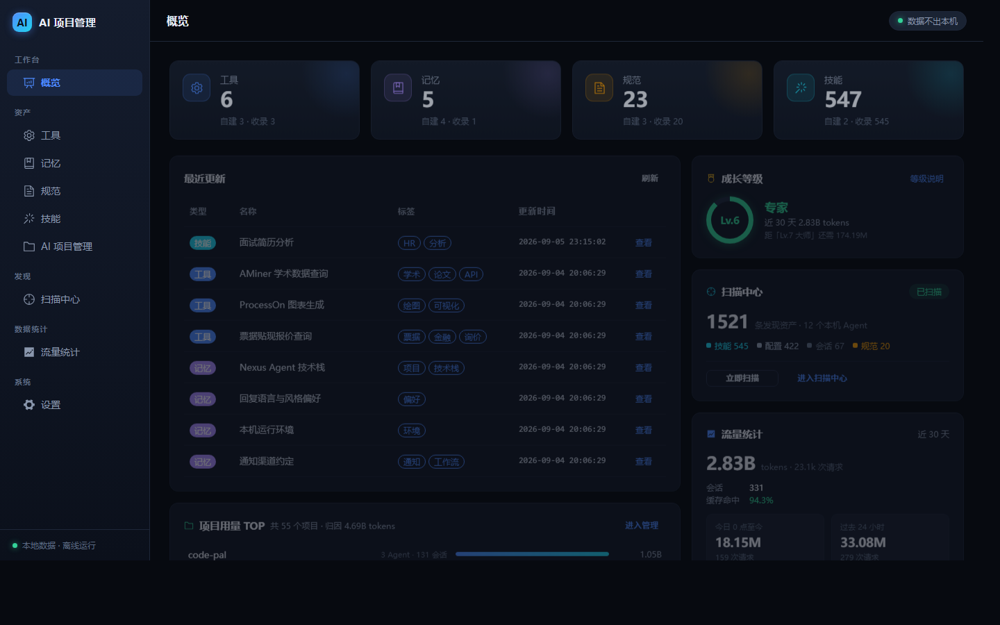
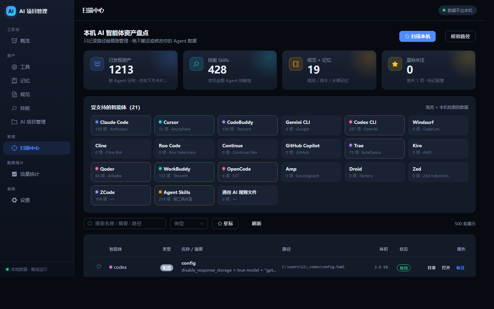
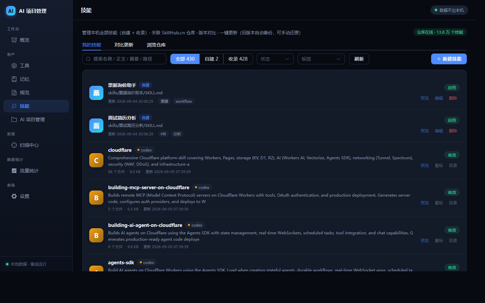
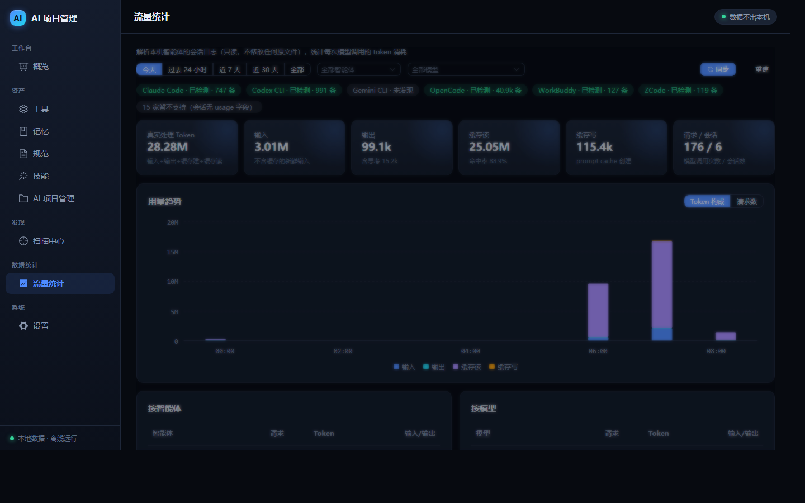
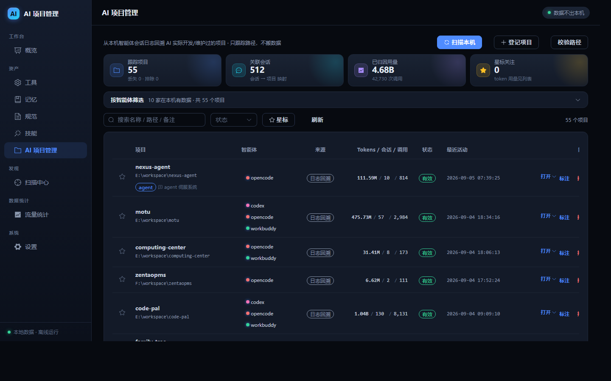
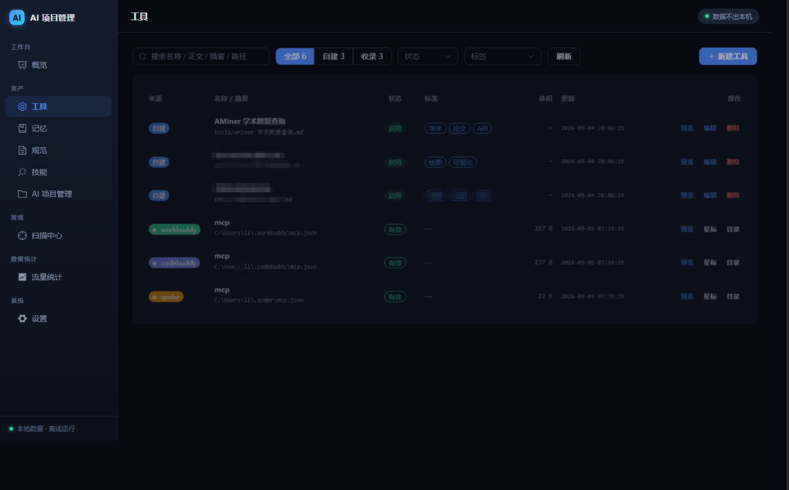
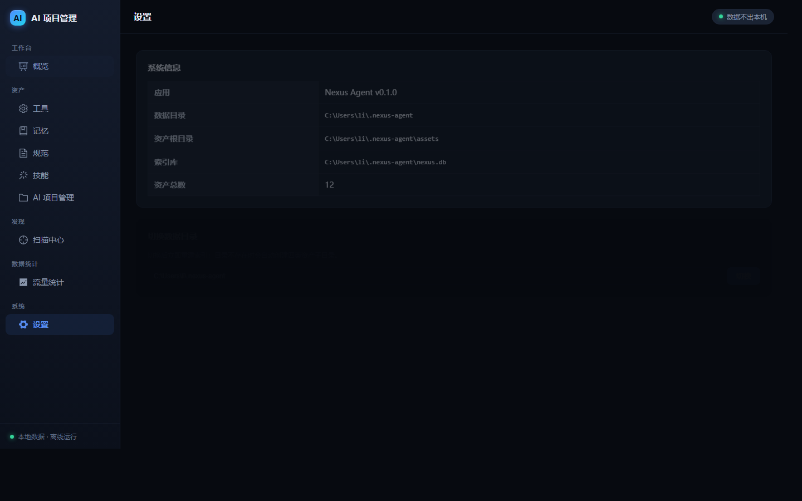

# Nexus Agent ·AI 360 卫士

**AI 360 卫士** 式的本机智能体管家 —— 扫描本机所有 AI 编程智能体留下的数据痕迹（技能 / 记忆 / 规范 / 配置 / 会话），
统一盘点、跟踪、加工管理；同时内置一份可被 AI 自己读写的 Markdown 资产库。**数据全部留在本机，绝不外传。**

<p align="center">
  
</p>

      

---

## 为什么需要它？

用了一段时间 Claude Code、Cursor、Codex、OpenCode……你会发现本机散落着各家的技能包、记忆文件、规范文档、配置，
还有每次调用模型消耗的 token 数据。它们格式不一、位置分散、无人管理。

**Nexus Agent 把这一切纳入一个本地工作台：**

| 能力 | 说明 |
|:--|:--|
| 🔍 **AI 360 卫士（扫描中心）** | 只读盘点 22 家本机智能体的数据痕迹，统一跟踪管理 |
| 📚 **自有资产库** | 人 + AI 共用的 Markdown 资产库（tools / memory / rules / skills），文件即事实源 |
| 📊 **流量统计** | 只读解析会话日志，统计每次模型调用的真实 token 消耗 |
| 🧩 **技能仓库** | 对接 SkillHub.cn，本地技能 ↔ 仓库版本对比、一键更新（自动备份） |
| 📁 **AI 项目管理** | 从会话日志回溯 AI 工作过的项目，用量归因到项目，多方式一键打开 |
| 🔌 **Agent / MCP 接入** | REST `/api/v1/agent/*` + MCP Server，AI 可直接读写自有资产库 |

## 核心理念

1. **只跟踪，不搬运**：扫描发现的其它智能体资产只记录路径做跟踪管理，绝不复制/修改原文件
2. **文件是事实源**：自有资产库的每条资产 = 一个 Markdown 文件（frontmatter + 正文），可直接用编辑器改、可 git 管理
3. **人机双读**：资产同时被「人」（UI / 编辑器）与「AI」（直接读文件或走 API / MCP）使用

## 截图一览

<details open>
<summary><b>扫描中心 —— 本机智能体资产盘点（22 家支持，本机实测 1213 条 / 约 2 秒）</b></summary>
<br>
<p align="center"></p>
</details>

<details>
<summary><b>技能中心 —— 自建技能 + 收录管理 + SkillHub 对比更新 + 浏览仓库</b></summary>
<br>
<p align="center"></p>
</details>

<details>
<summary><b>流量统计 —— 只读解析会话日志的真实 token 用量（6 家适配）</b></summary>
<br>
<p align="center"></p>
</details>

<details>
<summary><b>AI 项目管理 —— 会话日志回溯项目，用量归因，一键打开</b></summary>
<br>
<p align="center"></p>
</details>

<details>
<summary><b>资产库 —— 工具 / 记忆 / 规范 / 技能，Markdown 即事实源</b></summary>
<br>
<p align="center"></p>
</details>

<details>
<summary><b>设置 —— 数据目录 / 系统信息</b></summary>
<br>
<p align="center"></p>
</details>

## 快速开始

```powershell
git clone https://github.com/<you>/nexus-agent.git
cd nexus-agent

# 1) 后端
cd backend
python -m venv .venv
.\.venv\Scripts\pip install -r requirements.txt

# 2) 前端构建（产物直出 backend/app/static）
cd ..\frontend
npm install
npm run build

# 3) 启动桌面窗口（未装 pywebview 则自动降级为默认浏览器）
cd ..
python run_desktop.py
```

# 打包
cd frontend && npm run build        # 前端有改动时先构建
backend/.venv/Scripts/pyinstaller --noconfirm NexusAgent.spec

服务默认监听 `http://127.0.0.1:8721`，数据目录默认 `~/.nexus-agent`
（可用环境变量 `NEXUS_DATA_HOME` 修改，设置页可切换）。

> 仅想跑服务端（无窗口）：
> ```powershell
> cd backend
> .\.venv\Scripts\python -m uvicorn app.main:app --host 127.0.0.1 --port 8721
> ```

## 架构

```
桌面窗口(pywebview) ─ Vue3/Vite 前端 ─ FastAPI 后端
                                        │
            ┌───────────────────────────┼────────────────────────────┐
            │ 自有资产库                    │ 扫描与跟踪(AI 360 卫士)          │
   assets/{tools,memory,rules,skills}  scanners/{agents,engine,manager}
            │(文件=事实源)                 │ agent 适配器(22 家) → 发现项
        SQLite 索引(assets 表)          discovered 表(只存路径/摘要，不存正文)
            │                            │
        /api/v1/agent/* + MCP            /api/v1/scan/* + /api/v1/discovered/*
```

- **后端**：FastAPI + SQLite（WAL）
- **前端**：Vue 3 + Vite + Element Plus，构建产物直出 `backend/app/static`，单端口同源服务
- **桌面壳**：pywebview 单进程（未安装时自动降级浏览器打开）

## 三大能力详解

### A. AI 360 卫士：本机智能体扫描

启动后进入「扫描中心」→ 点「扫描本机」，只读盘点本机各智能体的数据目录。

受支持（22 家，数据驱动可扩展）：
Claude Code · Cursor · CodeBuddy · Gemini CLI · Codex CLI · Windsurf · Cline ·
Roo Code · Continue · GitHub Copilot · Trae · Kiro · Qoder · WorkBuddy ·
OpenCode · Amp · Droid · Zed · ZCode · 华为码道（CodeArts Space，`~/.codeartswork`；兼容 `~/.codeartsdoer`）·
Agent Skills（`~/.agents` 共享目录）· 通用规则文件兜底

**加工处理**（engine.py）：
- 噪声过滤：lock/log/backup/cache/隐藏文件等运行时垃圾不入库
- 价值分级：技能/规范/工具/记忆 > 配置 > 会话/杂项，超量时低价值先被淘汰
- Skill 聚合：一个技能包（含 scripts/、references/）聚合为一条记录，并读取 frontmatter 真实名称
- 配额截断：每智能体每类限量，海量会话日志不会淹没真资产

**跟踪管理**（只动自己的库，不动原文件）：
- 列表/搜索/按智能体/类型筛选，星标、备注、标签、归类
- 「校验路径」检测原文件是否被删除或修改（active/missing）
- 「打开/目录」直接跳转到原位置

### B. 自有资产库（人 + AI 共用的 Markdown 库）

四类资产 tools / memory / rules / skills，`frontmatter + 正文` 文件结构，UI 直接管理；
AI 通过 REST `/api/v1/agent/*` 或 MCP 读写。详见上文架构。

### C. 流量统计（Token 用量）

本机智能体的会话日志里已记录每次模型调用的 token 消耗，「流量统计」页**只读解析**这些日志
（绝不修改原文件），归一后入库展示：

- 支持解析（8 家，实测本机数据）：**Claude Code**（`~/.claude/projects` JSONL）· **Codex CLI**（`~/.codex/sessions`，
  `token_count` 事件）· **Gemini CLI**（`~/.gemini/tmp/*/chats`）· **OpenCode**（`opencode.db` 只读）·
  **ZCode**（`~/.zcode/cli/rollout` model-io JSONL，逐调用 usage）· **WorkBuddy**（`~/.workbuddy/traces`，
  轮次聚合口径：token 量真实、请求数按 workflow 轮计）· **华为码道**（Space 内核
  `~/.codeartswork/kernel/sessions` 逐调用 usage JSONL，meta.json 兜底模型/项目归因；
  兼容 IDE 模式 `~/.codeartsdoer/{codearts-data,vscode-data}/opencode.db` OpenCode 同构库双库合并，
  token 语义各按其源写入侧归一）· **CodeBuddy**（IDE 扩展日志
  `%APPDATA%/CodeBuddy CN/logs` 的 `notifyStepEnd` 逐 step usage，按行序
  `ModelProvider initialized` 归因模型；inputTokens 含缓存 → fresh 单列，
  请求数按 step 计、session 为 requestId）
- 无法支持：Trae / Qoder —— 会话存储不记录逐调用 token usage，本地无数据源
- 语义归一：Anthropic 的 input 不含缓存、OpenAI/Gemini 的 input 含缓存——写入侧统一为
  fresh 输入 + 缓存读/写单列（写侧一次归一，读侧免换算）
- 增量同步：JSONL 按字节游标只读新增（半截尾行不提交）；按 mtime/水位跳过未变文件；
  `request_id` UNIQUE + INSERT OR IGNORE 保证幂等；默认每 2 分钟自动增量（`NEXUS_USAGE_SYNC_INTERVAL` 秒，0 关闭）
- 指标：真实处理 token / 输入 / 输出 / 缓存读写 / 缓存命中率 / 请求数；小时·天趋势；按智能体·模型分组
- 第一期只统计 token 数，不折算成本；适配器数据驱动，新增一家智能体 = 新增一个 `usage/adapters/*.py`

### D. 技能仓库（SkillHub 关联与更新）

对接 [SkillHub.cn](https://skillhub.cn)（腾讯 AI Skills 社区，公开 API，无需登录），
把扫描发现的本地技能包与仓库建立关联，实现版本对比与一键更新：

- **关联匹配**：归一化（frontmatter 名称 / 目录名，自动剥离 `-1.0.2` 版本后缀）后批量查询
  `/api/v1/skills/batch`，一次请求完成全部本地技能 ↔ 仓库 slug 的映射
- **版本对比**：解析语义化版本（`2.23.2` / `v1.0` / `1.0.0-beta.1`），判定
  可升级 / 已最新 / 本地领先 / 无版本号 / 未收录 五种状态
- **一键更新**：下载仓库 zip（302→COS，限 200MB）→ 签名 `package_md5` 完整性校验（建议性）→
  zip-slip 防护 + 必须含 SKILL.md → 旧包备份到 `data_home/skillhub/backups/<slug>/<时间戳>/`（保留 3 份）→
  原地替换 → 刷新跟踪记录并在 `extra.hub` 记录来源
- **对比快照**：对比结果持久化到 nexus.db（`skillhub_compare` 单行快照），页面加载直接读快照
  （毫秒级、不访问网络），仅「重新对比」时联网刷新；更新成功后自动修正快照对应条目
- **安全阀**：技能目录为通用 `skills/` 容器（单文件布局）时拒绝更新，防止误删同级技能

### E. 项目管理（AI 开发/维护过的项目）

「扫描本机」时同步从各智能体的**会话日志回溯** AI 实际工作过的项目路径，形成项目跟踪库
（只记路径与元数据，绝不搬动项目文件）：

- **识别来源**（数据驱动提取器，新增 Agent = 加一个 `projects/discover.py` 提取器）：
  Claude Code（`~/.claude/projects` 行内 `cwd` 权威、转义目录名解码兜底）· Codex CLI（rollout
  `session_meta.cwd`）· OpenCode（`opencode.db` `session.directory`）· WorkBuddy（`~/.workbuddy/projects`
  行内 `cwd`）· Qoder（`~/.qoder/projects` 目录名解码）· 华为码道（Space `meta.json`
  `working_directory`；`~/.codeartsdoer` 两库 `session.directory` 合并提取）；指定 `project_roots` 时附加标记文件扫描
  （CLAUDE.md / AGENTS.md / .claude 等，复用扫描中心 SPECS）
- **成本可控**：每个会话文件只读首行（或仅查索引库），不做全文扫描
- **用量归因**：`usage_records.project` 由适配器写入侧归一（opencode/claude/codex/codearts），
  其余（WorkBuddy、历史数据）经 `project_sessions`（会话→项目）映射幂等回填——
  项目列表直接展示每个项目的累计调用次数与 token 总量
- **跟踪管理**：列表/搜索/按智能体·状态筛选，星标、备注、标签、改名；「校验路径」
  检测项目目录是否存在；手动登记项目；「排除」后扫描不再复活（可恢复）
- **多方式打开**：项目行「打开」下拉——资源管理器 / VS Code / Cursor / Trae / Windsurf /
  Qoder 直接打开项目，CLI 智能体（OpenCode / Codex / Claude Code / Gemini / 码道）在项目目录
  开新终端启动；可选项按本机 PATH 自动检测，未安装的置灰

## API 一览

| 方法 | 路径 | 说明 |
|:--|:--|:--|
| GET | `/api/v1/assets` · POST `/api/v1/assets` | 自有资产列表/新建 |
| GET/PATCH/DELETE | `/api/v1/assets/{kind}/{id}` | 自有资产详情/更新/删除 |
| POST | `/api/v1/assets/{kind}/{id}/status` | 启停/归档 |
| GET | `/api/v1/scan/agents` | 支持的智能体及检测状态 |
| POST | `/api/v1/scan/run` | 触发扫描（后台，不碰原文件） |
| GET | `/api/v1/scan/status` | 扫描进度 |
| GET/PATCH | `/api/v1/discovered` · `/api/v1/discovered/{id}` | 发现项列表 / 标注 |
| POST | `/api/v1/discovered/validate` | 校验记录对应文件 |
| POST | `/api/v1/discovered/open` | 打开文件/所在目录 |
| GET | `/api/v1/agent/*` · `/api/v1/stats` | Agent 上下文 / 统计 |
| GET | `/api/v1/skillhub/status` · `/categories` · `/skills` | 仓库连通性 / 分类 / 浏览搜索 |
| GET/POST | `/api/v1/skillhub/compare` | 读取对比快照（离线）/ 重新对比并保存 |
| GET | `/api/v1/skillhub/versions` | 仓库技能版本历史 |
| POST | `/api/v1/skillhub/update` | 更新本地技能（自动备份旧版本） |
| GET/POST | `/api/v1/projects` | 项目列表（含用量归因）/ 手动登记 |
| PATCH | `/api/v1/projects/{id}` | 项目标注（星标/备注/标签/改名） |
| POST | `/api/v1/projects/{id}/exclude` · `/restore` | 排除（扫描不复活）/ 恢复 |
| POST | `/api/v1/projects/validate` · `/open` | 校验路径 / 打开项目目录 |
| GET | `/api/v1/usage/adapters` | 会话来源支持与检测状态 |
| POST/GET | `/api/v1/usage/sync` · `/usage/sync/status` | 触发增量同步 / 任务状态 |
| GET | `/api/v1/usage/summary` · `/usage/trends` · `/usage/stats` | 汇总 / 趋势 / 分组 |
| GET | `/api/v1/usage/records` · `/usage/facets` · POST `/usage/reset` | 明细 / 筛选项 / 重建 |

## MCP 接入（读写自有资产库）

```json
{ "mcpServers": {
    "nexus-agent": {
      "command": "<repo>/backend/.venv/Scripts/python.exe",
      "args": ["-m", "app.mcp_server"],
      "cwd": "<repo>/backend",
      "env": { "NEXUS_DATA_HOME": "C:/Users/you/.nexus-agent" } } } }
```

## 环境变量

| 变量 | 默认 | 说明 |
|:--|:--|:--|
| `NEXUS_DATA_HOME` / `NEXUS_HOME` | `~/.nexus-agent` | 数据根目录（资产 + SQLite） |
| `NEXUS_HOST` / `NEXUS_PORT` | `127.0.0.1` / `8721` | 服务监听地址 |
| `NEXUS_USAGE_SYNC_INTERVAL` | `120` | 用量自动增量同步间隔（秒，0 关闭） |

## 路线图

- [x] M1-M6 后端骨架 / 数据层 / API / Vue3 工作台 / pywebview 桌面壳 / Agent 接入（HTTP + MCP）
- [x] M7 AI 360 扫描中心（22 家适配 + 加工 + 跟踪库 + UI）
- [x] M8 流量统计（6 家会话 token 解析 + 增量同步 + 仪表盘）
- [x] M9 技能仓库（SkillHub 关联 + 版本对比 + 一键更新）
- [x] M10 项目管理（会话日志回溯 + 用量归因 + 跟踪 UI）
- [ ] 数据打包导出 / 多数据目录切换增强
- [ ] token 成本折算（本地价格表）

## 免责声明

本项目**只读**访问各智能体的数据目录，只写自己的 `NEXUS_DATA_HOME`；
扫描与统计均不修改、不上传任何原文件，请放心使用。各智能体版本迭代可能导致
数据目录结构变化，适配器以数据驱动方式维护，欢迎提 Issue/PR。

---

<div align="center">

如果对你有帮助，欢迎点个 Star ⭐

</div>
